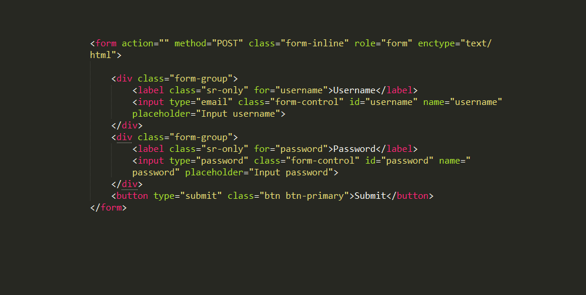
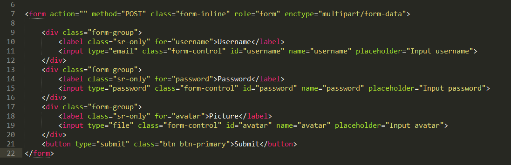
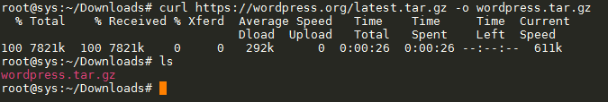

# Báo cáo: Tìm hiểu cách sử dụng câu lệnh curl

- [Tổng quan về curl](#about)
- [Cách sử dụng và các tùy chọn của câu lệnh curl](#isuse)
- [Một vài ví dụ sử dụng curl](#example)

___

## 
- `curl` là một khái niệm mới mẻ dùng để gửi request đến một đường dẫn nào đó trên internet và bạn có thể tùy chỉnh các thông tin như `User Egent` phía đường link không chặn request. Bạn có thể đăng nhập vào một hệ thống từ xa, gửi dữ liệu qua đó,...
	- `curl` là một công cụ giao tiếp mạnh mẽ, đa giao thức phổ biến như HTTP, HTTPS, FTP, FTPS, SCP, SFTP, TFTP, LDAP, LDAPS, dict, TELNET, FILE, IMAP, POP3, SMTP và RTSP
	- `curl` hỗ trợ nhiều tính năng bao gồm post, cookie, chứng thực, tải các tập tin được chia nhỏ, giới hạn tốc độ tải tập tin, giới hạn kích thước tối đa của tập tin được tải, hiển thị thanh tiến trình, ...
	- Thông thường `curl` được cài đặt mặc định trong các bản phân phối của Linux. trong trường hợp `curl` chưa được cài đặt, bạn có thể cài đặt nó như sau:
		+ RedHat, CentOS: `yum install curl`
		+ Debian, Ubuntu: `apt-get install curl`
___

## 

+ Cú pháp chung của `curl` là:
	> `curl [options] URL`

+ Các option có thể có các giá trị sau:
	- `-s| --silent`: Sử dụng tùy chọn này nếu chúng ta không muốn hiển thị các thông tin của quá trình tải.
	- `-o| --output <file>`: Sử dụng tùy chọn này nếu như bạn muốn tải về một file nào đó. Nếu bạn sử dụng {} hoặc [] trong URL, nó sẽ thử lấy từ nhiều url đó. Ví dụ `curl http://{one,two}.site.com -o "file_#1.txt"` Nó sẽ lấy tài nguyên từ 2 site http://one.site.com và http://two.site.com
	- `--progress| --progress-bar`: Hiển thị một thanh tiến độ tải thường được kết hợp với tùy chọn `-o`
	- `-C, --continue-at <offset>`: Sử dụng tùy chọn này khi muốn tiếp tục tải file theo hình thức chia nhỏ,...  curl cho phép tiếp tục tải tại bytes thứ offset. Sử dụng `-C -` để curl tự động tìm bytes để tiếp tục tải nếu như không nhớ chính xác giá trị offset.
	- `-e Referer_URL target_URL| --referer Referer_URL target_URL`: Sử dụng để thiết lập referer cho trang web.
	- `-b, --cookie <name=data>`: Sử dụng tùy chọn để cung cấp cookie cho request. Các giá trị cookie cách nhau bới dấu ` ; `. Ví dụ: "user=slynux;pass=hack"
	- `-c <file name>| –cookie-jar <file name>`: Chỉ ra file mà lưu trữ các cookie.
	- ` -A text| --user-agent text`: Sử dụng để thiết lập user-agent là `text`.user-agent cho phép máy chủ HTTP nhận biết thiết bị nào và phần mềm nào đang gửi yêu cầu đến nó.
	- `-u <user:password>| --user <user:password>`: Cho phép sử dụng username và password để chứng thực, login vào server. Bạn có thể không cung cấp mật khẩu ngay trong câu lệnh, một prompt sẽ xuất hiện yêu cầu nhập mật khẩu nếu như nó không xuất hiện trong câu lệnh
	- `-X method-http| --request method-http`: Sử dụng tùy chọn này khi chỉ muốn gửi 1 yêu cầu tới URL mà không kèm theo dữ liệu
	- `-d <data>| --data <data>`: Gửi dữ liệu là `data` theo phương thức POST lên http servers sử dụng  content-type:application/x-www-form-urlencoded
	- `-F <name=content>, --form <name=content>`: tùy chọn này được sử dụng khi content-type:multipart/form-data. Thêm hậu tố @ sau dấu =  để gửi lên servers một file. tùy chọn này sử dụng phương thức POST của http servers. Ví dụ: `curl -F "web=@index.html;type=text/html" url.com` sẽ gửi lên server 1 file là `index.html` với tên của trường input là `web`, `type=text/html` là nói với curl rằng đó sẽ là 1 form với content-type: text/html
	- Còn rất nhiều các tùy chọn khác của curl. Bạn có thể xem chi tiết bằng việc sử dụng `man curl` hoặc `info curl`.
___	

## <a name="example">Các ví dụ cơ bản để sử dụng curl</a>

- Trường hợp gửi yêu cầu sử dụng phương thức POST có kèm theo dữ liệu dạng văn bản thì bạn sử dụng tuỳ chọn --data kèm theo là các trường dữ liệu và giá trị tương ứng. Ví dụ như sau:
	> `curl --data "username=username&password=password" url.com`

	tương ứng với form được thiết kế như sau:
	> 

- Khi gửi dữ liệu multipart (như tải lên tập tin) thì chúng ta sẽ sử dụng tuỳ chọn --form. Ví dụ sau dùng để gửi lên máy chủ dữ liệu của tập tin my_photo.jpg và dữ liệu này được gắn với tên trường tên là avatar:
	> `curl --data "username=username&password=password" --form "avatar@=my_photo.jpg" url.com`

	tương ứng với form được thiết kế như sau:
	> 

- Khi bạn muốn tải một file từ web server về máy local tại đường dẫn `https://wordpress.org/latest.tar.gz` và muốn lưu tên file là `wordpress.tar.gz` bạn có thể làm như sau:
	> `curl https://wordpress.org/latest.tar.gz -o wordpress.tar.gz`
	
	kết quả ta nhận được như sau:
	> 