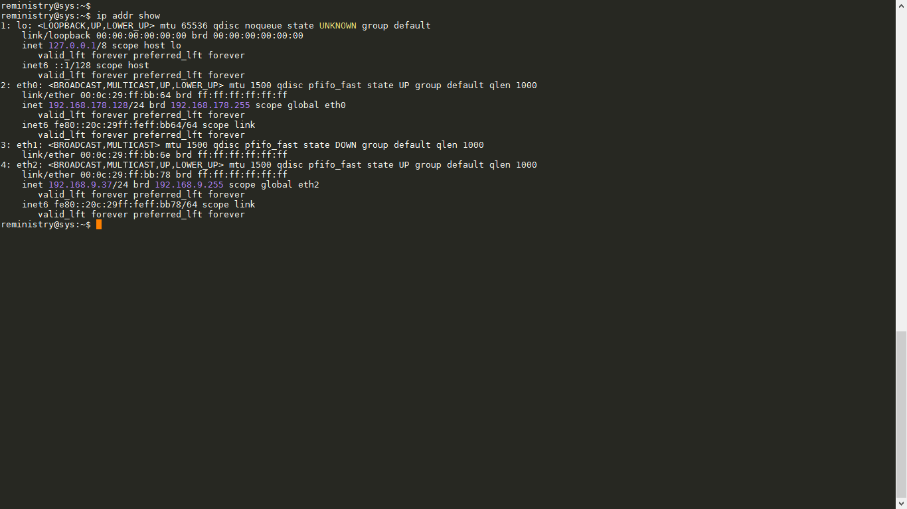
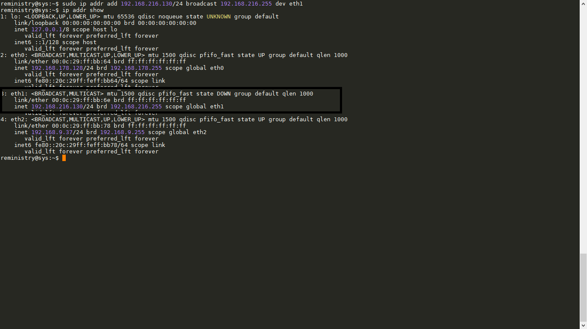
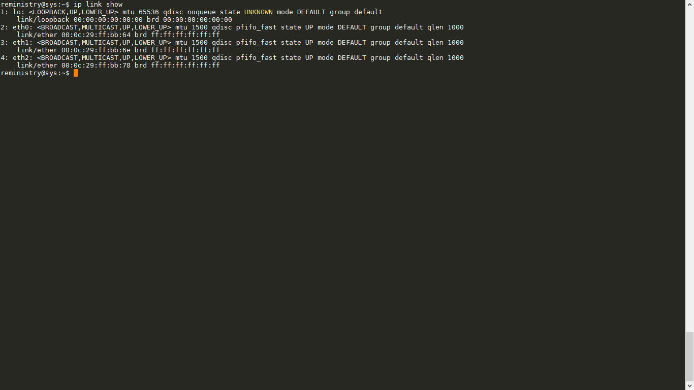

# Báo cáo: Tìm hiểu cách sử dụng ip command

# Mục lục

- [Chức năng của ip command](#chucnang)
- [Cú pháp câu lệnh](#cuphap)
	+ [Các args trong câu lệnh](#options)
- Một số ví dụ
	+ [ip add](#ipadd)
	+ [ip route](#iproute)
	+ [iplink](#iplink)

- <a name="chucnang">## Chức năng của ip command</a>

	+ Trong hệ thống Linux, để hiển thị, cấu hình các thông tin về các interface mạng, các thiết bị ta có thể sử dụng nhiều cách. Nhưng cách phổ biến nhất vẫn là sửa nội dung file cấu hình mạng hoặc sử dụng câu lệnh!
	+ `ip command` được tạo ra nhằm để hiển thị, thao tác cấu hình, định tuyến một cách dễ dàng nhất.

- <a name="cuphap">Cú pháp của ip command</a>

	+ Cú pháp chung cho ip command là:
		> `ip [ OPTIONS ] OBJECT { COMMAND | help }`

- <a name="options">## Giải thích về các tham số trong câu lệnh ip</a>
	
	+ OPTIONS là các tùy chọn của câu lệnh gồm các giá trị cơ bản sau:

		* `-r| -resolve`: Sử dụng resolver tên của hệ thống để in ra địa chỉ host
		
		* ` -s| -stats| -statistics`: Đưa ra thông tin thống kê

	+ OBJECT là các chương trình con được sử dụng theo các giá trị sau:
       * `addr` : protocol (IP or IPv6) address on a device.

       * `addrlabel` : label configuration for protocol address selection.

       * `l2tp`   : tunnel ethernet over IP (L2TPv3).

       * `link`   : network device.

       * `maddr` : multicast address.

       * `monitor` : watch for netlink messages.

       * `mroute` : multicast routing cache entry.

       * `mrule`  : rule in multicast routing policy database.

       * `neighbour` : manage ARP or NDISC cache entries.

       * `netns`  : manage network namespaces.

       * `ntable` : manage the neighbor cache's operation.

       * `route`  : routing table entry.

       * `rule`   : rule in routing policy database.

       * `tcp_metrics` : manage TCP Metrics

       * `tunnel` : tunnel over IP.

       * `tuntap` : manage TUN/TAP devices.

       * `xfrm`   : manage IPSec policies.

- Một số ví dụ về câu lệnh

	+ Phía dưới là hình ảnh cấu hình của card mạng trong máy cá nhân của mình gồm như sau:
		> 

	+ Câu lệnh về `ip addr`:
		> Cú pháp: `ip addr add| change| del| flush| help| replace| show`

		Để biết chi tiết về câu lệnh, bạn hãy dùng:
		> `ip addr help`

		Ví dụ: Mình muốn gán 1 địa chỉ ip: 192.168.216.130, subnetmark: 255.255.255.0, broadcast: 192.168.216.255 cho eth1 interface thì cần làm như sau:

		> `sudo ip addr add 192.168.216.130/24 broadcast 192.168.216.255 dev eth1`

		Kết quả là:
		

	+ Câu lệnh về `ip link`:
		> Cú pháp: `ip link add| delete| help| set| show`

		Để biết chi tiết về câu lệnh này, bạn hãy sử dụng:
		> `ip link help`

		Ví dụ: Để đưa interface mạng eth1 đã cấu hình trên vào hoạt động, ta cần phải chạy câu lệnh sau:
		> `ip link set eth1 up`

		Kết quả là:
		

	+ Câu lệnh về `ip route`:
		> Cú pháp: `ip route add| append| change| del| flush| get| help| list| monitor| replace`

		Để biết chi tiết về câu lệnh này, bạn hãy sử dụng:
		> `ip route help`

		Ví dụ: Để cấu hình định tuyến cho để cho gói tin từ mạng 192.168.216.0/24 đi tới mạng 192.168.178.0/24 cần phải qua cổng 192.168.217.2 ta làm như sau:
		> `sudo ip route add 192.168.178.0/24 via 192.168.217.2`

		Bạn có thể tham khảo [tại đây](http://hocmang.net/2014/11/29/dinh-tuyen-tinh-tren-centos/)

Chúc các bạn vui vẻ!