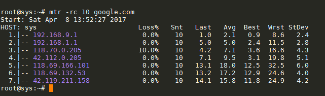
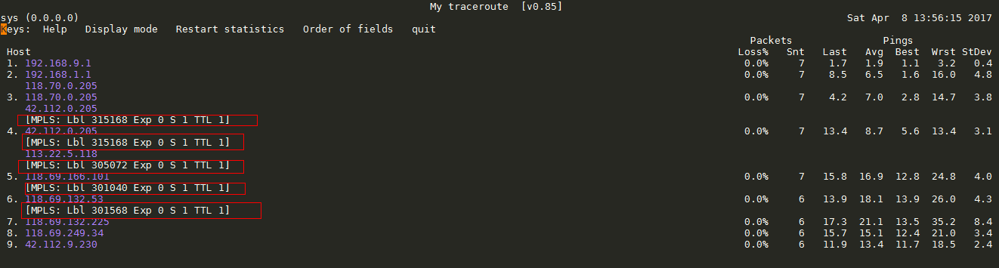
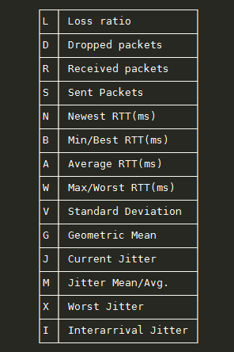
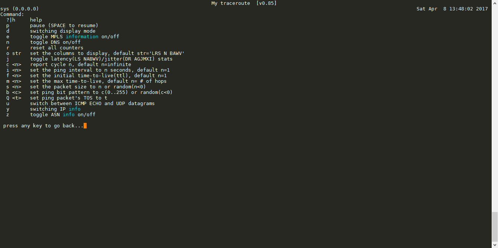
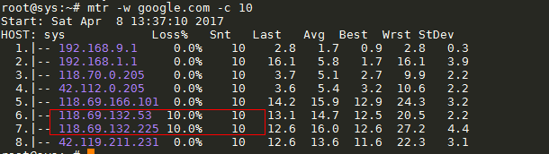

# Báo cáo: Tìm hiểu mtr command

# Mục lục

- [Giới thiệu về mtr](#about)
- [Cú pháp và các tùy chọn của lệnh mtr](#syntax)
- [Phím tắt khi sử dụng mtr](#shortkey)
- [So sánh sự khác nhau giữa mtr và traceroute, ping command](#diff)

___

# Nội dung

- <a name="about">## Giới thiệu về mtr</a>
	
	+ `mtr` là một câu lệnh cho phép thực thi chương trình chuẩn đoán mạng trên terminal linux
	+ `mtr` là một chương trình được phát triển dựa trên chức năng của hai câu lệnh chuẩn đoán mạng khác là: `traceroute` và `ping`
	+ Khi hoạt động, `mtr` sẽ dò tìm các kết nối mạng giữa host mà mtr đang chạy (nơi mà bạn thực hiện chạy câu lệnh) với HOSTNAME - host mà bạn muốn chuẩn đoán bằng việc gửi các gói tin với `TTLs` (Time To Life) thấp và ghi nhận thời gian phản hồi của các router mà nó đi qua. Điều này cho phép `mtr` in ra tỉ lệ phản hồi và thời gian phản hồi của tuyến đường internet tới HOSTNAME. Sự gia tăng đột ngột của tỉ lệ mất gói tin hoặc thời gian phản hồi thường là dấu hiệu cho thấy đó là một kết nối xấu - quá tải.

___

- <a name="syntax">## Cú pháp và các tùy chọn của lệnh mtr</a>

	+ Cú pháp chung cho câu lệnh `mtr` là:
		> `mtr [options] HOSTNAME`

	+ Trong đó:
		* `HOSTNAME`: là địa chỉ của host bạn cần chuẩn đoán mạng
		* `options`: là các thuộc tính có thể có hoặc không trong câu lệnh và có thể có các giá trị sau:
			- `-h| --help`: Hiển thị trợ giúp về sử dụng câu lệnh.
			- `-v| --version`: Hiển thị phiên bản hiện tại của `mtr`.
			- `-c COUNT| --report-cycles COUNT`: Quy định số lần thực hiện gửi tin là COUNT. - Nhận biết qua trường `Snt` trong quá trình thực hiện lệnh `mtr`.
			- `-r| --report`: Sau khi quá trình thực hiện gửi `COUNT` gói tin kết thúc sẽ in ra kết quả cuối cùng của câu lệnh.
				> 
			- `-w| --report-wide`: Trong kết quả trả về sẽ đưa ra đầy đủ thông tin về tên của HOSTNAME
			- `-s BYTES| --psize BYTES`: Quy định kích thước của gói tin được gửi đi bở mtr phục vụ cho quá trình thăm dò.
			- `-e| --mpls`: Yêu cầu mtr hiển thị thêm về thông tin của icmp trong gói tin phản hồi.
				> 
			- `-n| --no-dns`: Sử dụng tùy chọn này để buộc mtr hiển thị các IP và không cố gắng phân giải tên máy chủ lưu trữ.
			- `-o  fieldname| --order fieldname`: Sử dụng tùy chọn này để chỉ định các trường và thứ tự của chúng khi chạy mtr.
				> Giá trị của fieldname được cho như hình bên dưới:
				
			- `-g| --gtk`: Sử dụng mtr với giao diện người dùng (có thể)
			- `-a IP.ADD.RE.SS| --address IP.ADD.RE.SS`: Sử dụng tùy chọn này để buộc socket của gói tin đi ra qua một interface khai báo.(không áp dụng cho DNS requests)
			- `-i SECONDS| --interval SECONDS`: Quy định khoảng thời gian chờ gửi tin là SECONDS giây. (mặc định là 1s)
			- `-u| --udp`: Sử dụng udp datagrams thay thế cho icmp_echo
			- `-t| --tcp`: Sử dụng tcp datagrams thay thế cho icmp_echo
			- `-P port| --port port`: Quy định cổng kết nối sử dụng để chuẩn đoán
			- Ngoài ra còn nhiều tùy chọn khác, bạn có thể xem chi tiết bằng việc sử dụng câu lệnh `man mtr`, ...

___

- <a name="shortkey">## Phím tắt khi sử dụng mtr</a>

	+ Trong quá trình sử dụng câu lệnh đơn giản `mtr HOSTNAME`. Bạn có thể sử dụng thêm các tùy chọn khác trong khi mtr còn đang hoạt động bằng việc nhấn các phím được cho như hình sau đây để lựa chọn và thiết lập các tùy chọn:
	> 

___

- <a name="diff">## So sánh sự khác nhau giữa mtr và traceroute, ping command</a>

	- mtr là một công cụ chuẩn đoán mạng kết hợp bởi 2 công cụ `ping` và `traceroute`. Nó cho phép biết đường đi giống như `traceroute`, thời gian phản hồi của gói tin giống như `ping` và tỉ lệ tin bị lỗi, đã gửi mà ping không có. Ta có thể biết được tại thời điểm nào, tại hop nào mà gói tin bị mất và mất bao nhiêu %, ...
	> 
	Nhìn vào hình, bạn có thể thấy được tại hop 6 và hop 7, phần trăm gói tin bị thất lạc là 10% ^.^ Ngoài ra còn biết được thời gian phản hồi gói tin, ...