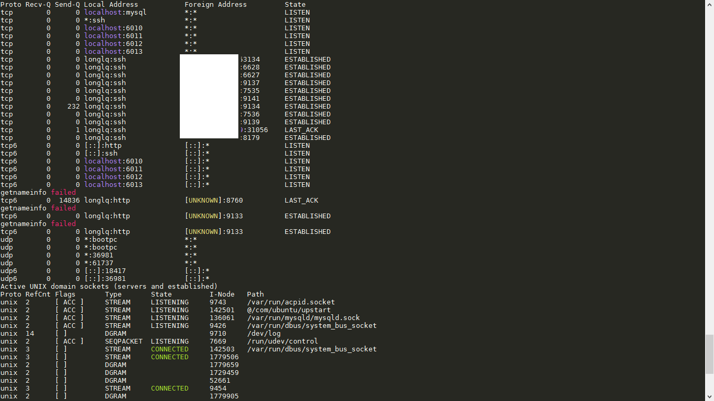
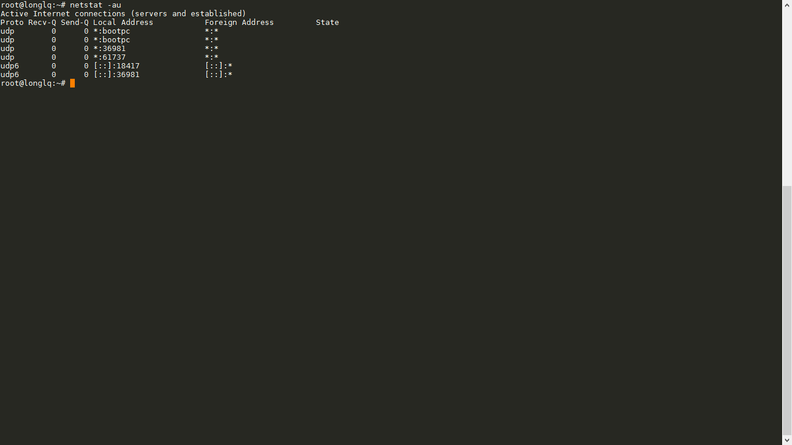
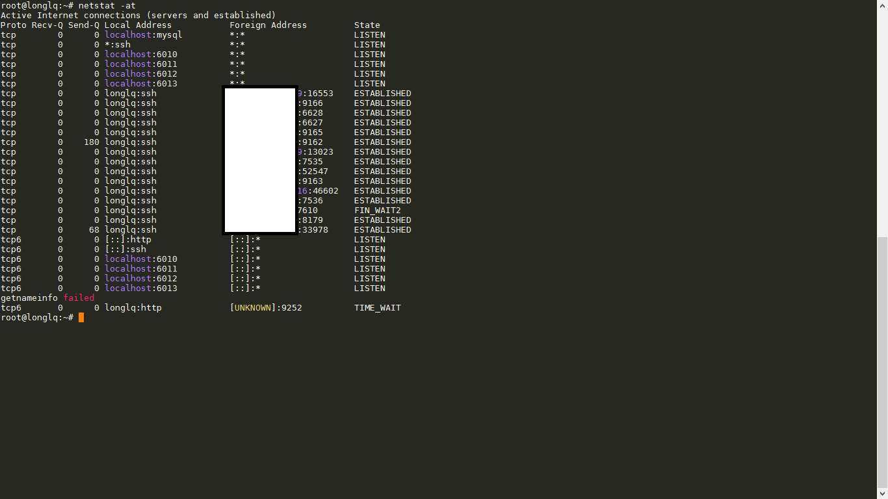
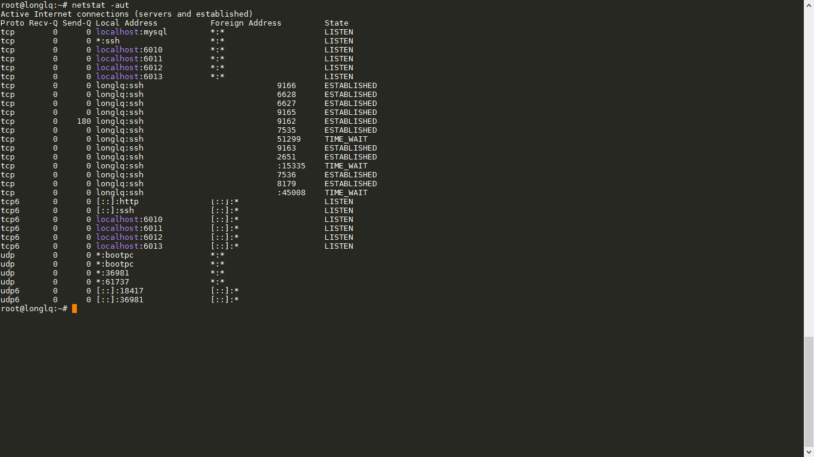
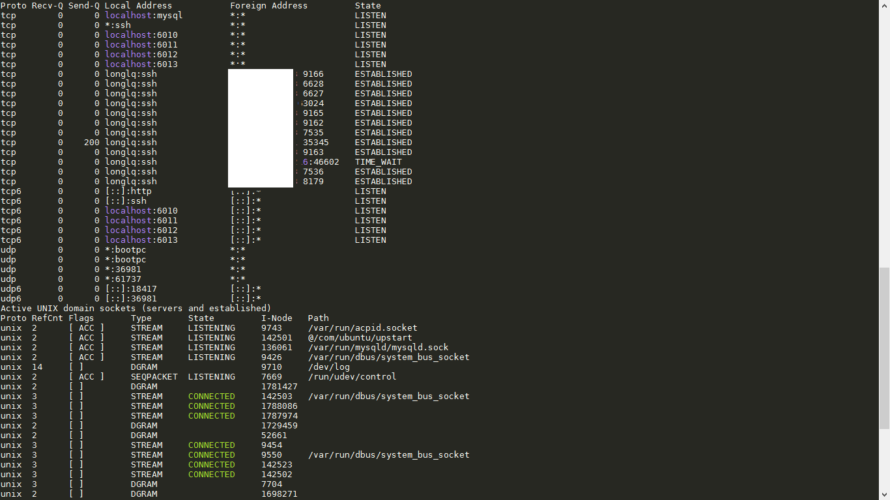
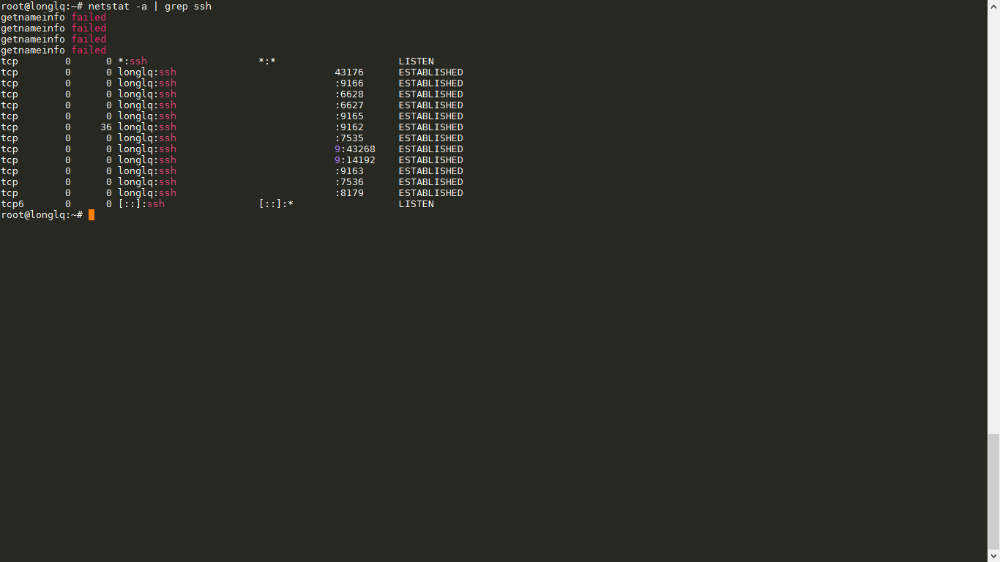
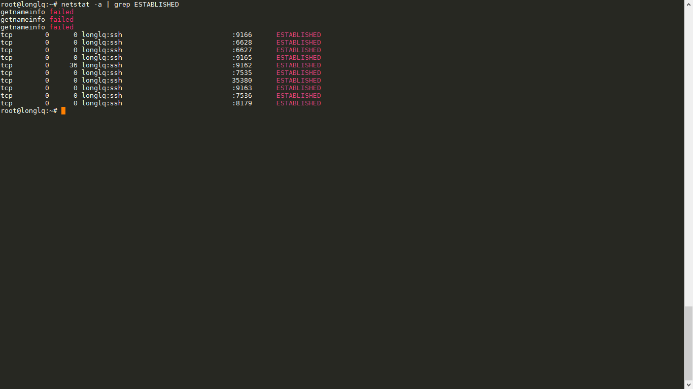

# Báo cáo: Hướng dẫn sử dụng netstat command

## Mục lục
- 1. [Giới thiệu](#about)
- 2. [Chi tiết câu lệnh](#setup)
- 3. [Các ví dụ](#instr)

## Giới thiệu

- `netstat` là câu lệnh cho phép hiển thị các trạng thái kết nối mạng, bảng định tuyến từ các interfaces mạng, các cổng
- Cho phép giám sát hệ thống theo 2 chiều kết nối (vào và ra) 

- Cú pháp chung của câu lệnh netstat là:
	> `netstat options`

	+ trong đó:
		- `-a`: Cho phép hiển thị tất cả các kết nối và các cổng nghe.
		- `--tcp| -t`: Cho phép hiển thị các kết nối thông qua tcp
		- `--udp| -u`: Cho phép hiển thị các kết nối thông qua udp
		- `--listening| -l`: Hiển thị các cổng socket đang hoạt động ( listening )
		- `--route| -r`: Hiển thị bảng định tuyến.
		- `--numeric| -n`: Hiển thị địa chỉ ip host thay vì hiện tên
		- `--statistics| -s`: Hiển thị tổng quan về mỗi giao thức
		- `--continuous|-c`: Liên tục hiển thị các trạng thái của mạng
	+ Để xem thêm các lệnh khác, bạn có thể vào terminal qua: `man netstat`

- Các ví dụ:

+ Hiển thị tất cả các kết nối và các cổng nghe, ..
	> `netstat -a`
		

+ Lọc các port về udp:
	> `netstat -au`
		

+ Lọc các port về tcp:
	> `netstat -at`
		

+ Lọc các port về tcp và udp:
	> `netstat -aut`
		

+ Hiển thị các port đang LISTEN:
	> `netstat -al`
		

+ Hiển thị port mặc định của SSH, MySQL, HTTP:
	> `netstat -al | grep ssh`
		

+ Hiển thị các port đang thiết lập kết nối:
	> `netstat -a | grep ESTABLISHED`
		

Phía trên là một vài câu lệnh quan trọng sẽ giúp ích rất nhiều cho các bạn! Cảm ơn bạn đã đọc bài viết của mình!
