# Báo cáo: Tìm hiểu tùy chọn của lệnh ping, fping và thực hành

# Mục lục

- Chức năng của lệnh
	+ [ping command](#ping)
	+ [fping command](#fping)

- Các tùy chọn của lệnh
	+ [ping command](#ping-options)
	+ [fping command](#fping-options)

- Các ví dụ
	+ [fping command](#fping-examples)

# Nội dung

- Chức năng của lệnh

	+ <a name="ping">Chức năng của ping command</a>
		- `ping` là một công cụ khá đơn giản nhưng hữu ích cho việc chuẩn đoán mạng. `ping` sẽ gửi một gói ICMP (Internet Control Message Protocol) đến host, nếu host đó phản hồi lại nghĩa là host đó tồn tại.
		- `ping` giúp chúng ta biết được lượng thời gian một gói tin đi từ máy tính của mình đến một host nào đó.
		- `ping` hoạt động bằng cách gửi 1 gói tin đến một host, sau đó xem mất thời gian bao lâu gói tin đó quay trở lại, cách này xác định được tốc độ của kết nối và thời gian để một gói tin đi và quay trở lại và chia bốn (round trip time)

	+ <a name="fping">Chức năng của fping command</a>
		- `fping` là một chương trình có chức năng tương tự như `ping`. Điểm khác biệt của fping đó là nó có thể khai báo nhiều đối tượng host trên một dòng lệnh, hoặc khai báo các host đó trong một file.
		- Không giống như `ping`, `fping` có thể được sử dụng trong các kịch bản và kết quả của nó được thiết kế để cho ta có thể phân tích một cách dễ dàng.
		- Cách cài đặt:
			> `#~ apt-get install fping`

- Các tùy chọn của câu lệnh

	+ <a name="ping-options">Các tùy chọn của ping</a>
       - `-c count`:	Thực hiện gửi `count` gói tin rồi kết thúc ping.

       - `-f`:	Biết đến như là `Flood  ping`. Mỗi thông tin gói tin được in ra thay bởi dấu ` . `. Được biết đến như là một tùy chọn để tấn công DDOS hệ thống.

		- `-i interval`: Thực hiện ping gián đoạn sau mỗi khoảng thời gian `interval` tính theo đơn vị giây (s)

       - `-I interface`:	Khai báo card mạng sẽ sử dụng để ping

       - `-r`: Bỏ qua bảng định tuyến, gửi gói tin trực tiếp đến một host.

       - `-s packetsize`: Khai báo kích thước của gói tin gửi đi là `packetsize` bytes. (default là 56)

	+ <a name="fping-options">Các tùy chọn của fping</a>
       - `-a`:  Hiển thị rằng hệ thống còn tồn tại

       - `-A`:  Hiển thị các đối tượng theo địa chỉ chứ không phải bằng tên miền DNS

       - `-b n`:	Khai báo số bytes để gửi bằng `n bytes`. Kích thước nhỏ nhất là 12. (default là 56)

       - `-B n`:	Khai báo thời gian chờ cho mỗi gói tin phản hồi bởi `n` giây trước khi tiến hành gửi một gói tin mới. n phải là một con số thập phân. Giá trị mặc định của n là 1.5

       - `-c n`:	Khai báo số lượng gói tin request gửi đến mỗi đối tượng là n gói tin.

       - `-C n`:	Tương tự như  `-c` nhưng có hiển thị thời gian bên cạnh theo đơn vị milliseconds 

       - `-d`:   Sử dụng DNS để tra cứu địa chỉ của gói ping trả về.

       - `-e`:   Hiển thị round-trip của mỗi packet

       - `-f file`:  Đọc các danh sách các địa chỉ từ 1 file (chỉ được sử dụng bởi root). Những người khác có thể sử dụng như sau: `% fping < targets_file`

       `-g addr/mask`:	Sinh ra 1 loạt các địa chỉ ip từ địa chỉ đã khai báo. Ví dụ: `fping -g 192.168.1.0/24` hoặc `fping -g 192.168.1.1 192.168.1.254`

       - `-i n`:	Quy định khoảng thời gian giữa 2 gói tin được gửi bởi n milliseconds. (default là 25)

       - `-l`:	Gửi không giới hạn gói tin tới đích.

       - `-m`: Gửi ping đến các địa chỉ qua nhiều interface.

       - `-q`:	Hiển thị thông tin tổng quan chỉ khi kết thúc quá trình gửi tin thành công.

       - `-Q n`: Giống như `-q` nhưng kết quả trả về sau n giây

       - `-S addr`:	Thiết lập địa chỉ nguồn
		
	   - `-r n`: Quy định gửi lại n lần gói tin tới một địa chỉ nếu nó bị lỗi

       - `-t n`:	Dừng gửi tin sau n giây

       - `-u`:   Hiển thị các địa chỉ unreachable.

       - `-s`: In thống kê.

## Các ví dụ

+ <a name="fping-example">Ví dụ về fping command</a>

	- `fping google.com google.com.vn`
		> 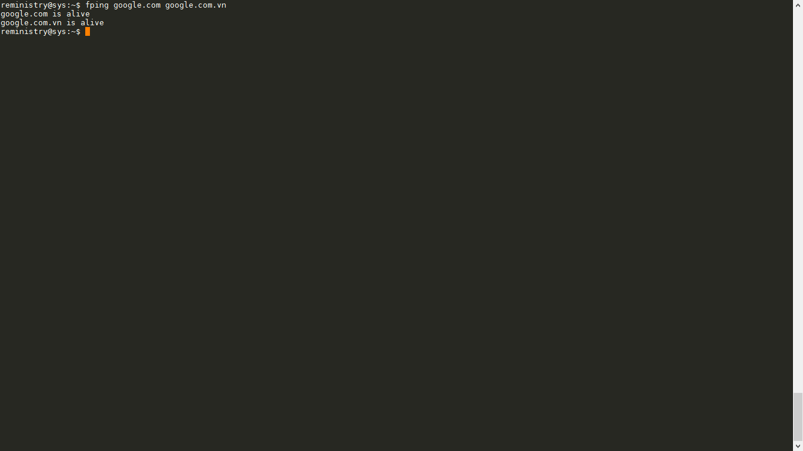

	- `fping 192.168.0.1`
		> 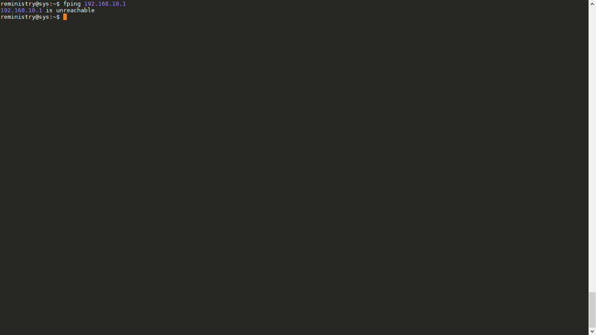

	- `fping -S 192.168.216.130 google.com.vn`
		> 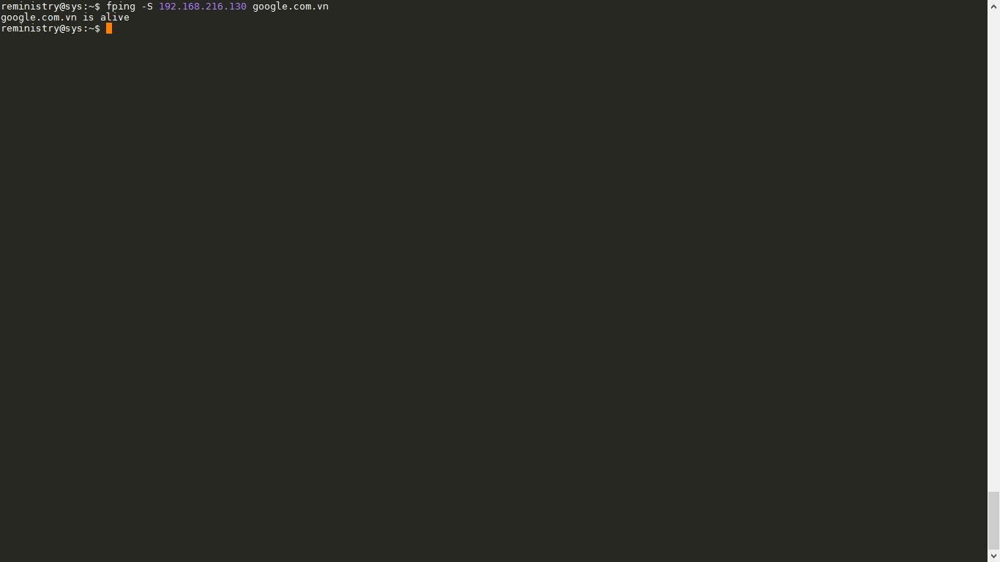

	- `fping -i 2000 google.com.vn`
		> 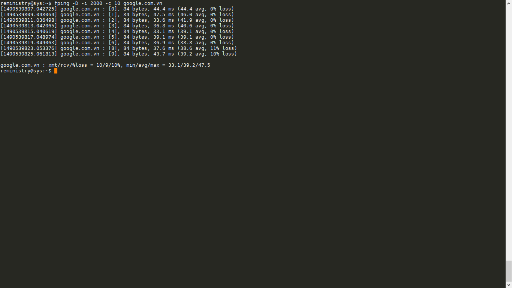

	- `fping -b 200 google.com`
		> 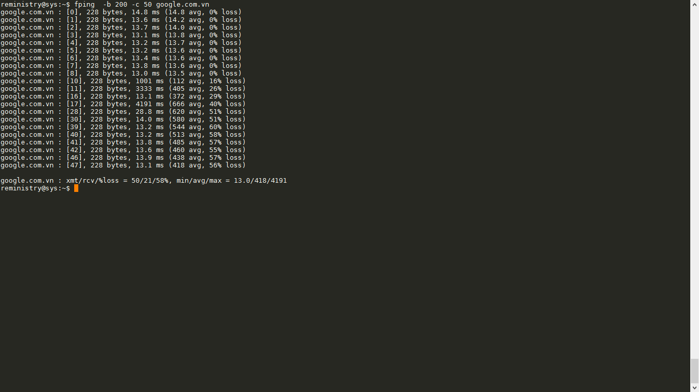

	- `fping -q google.com`
		> 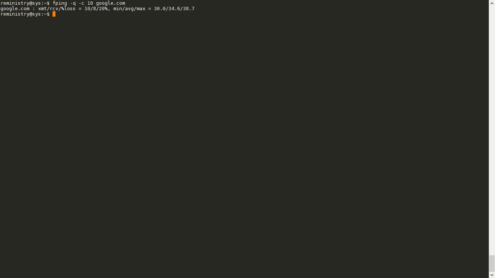

	- `fping -DlQ 3 google.com.vn`
		> 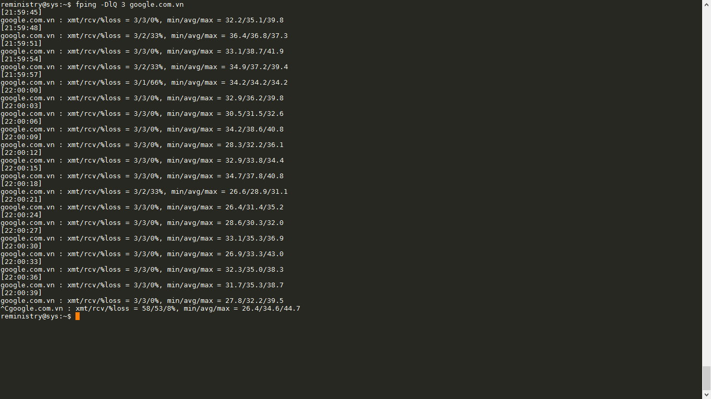

	- `fping -c 20 -Q 2 192.168.216.1`
		> 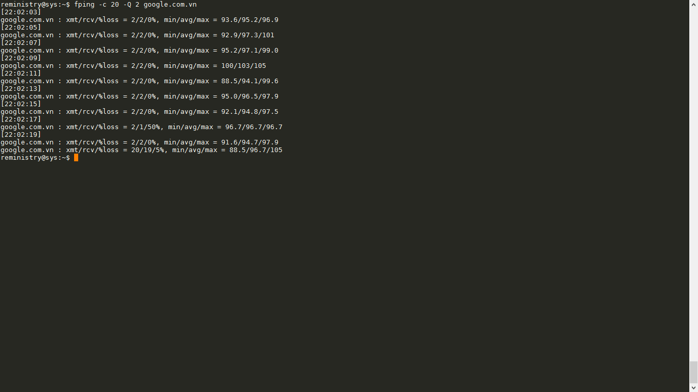

	- `fping -A google.com.vn`
		> 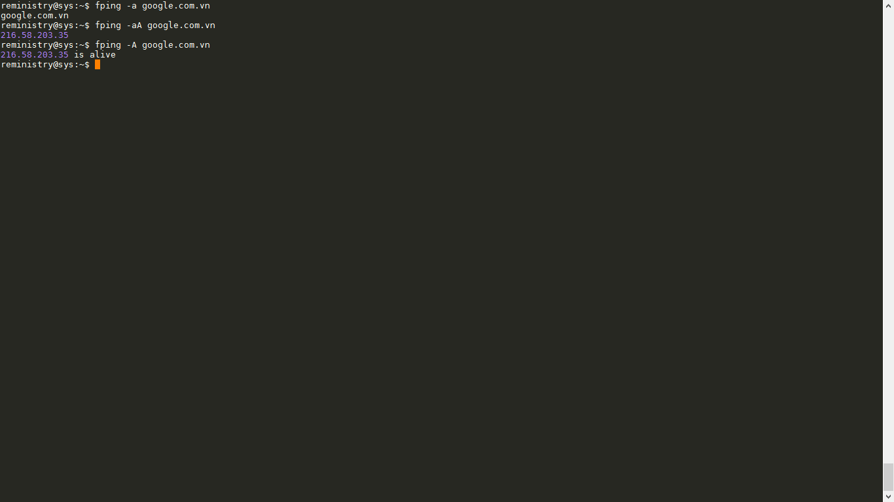

	- `fping -d 8.8.8.8`
		> 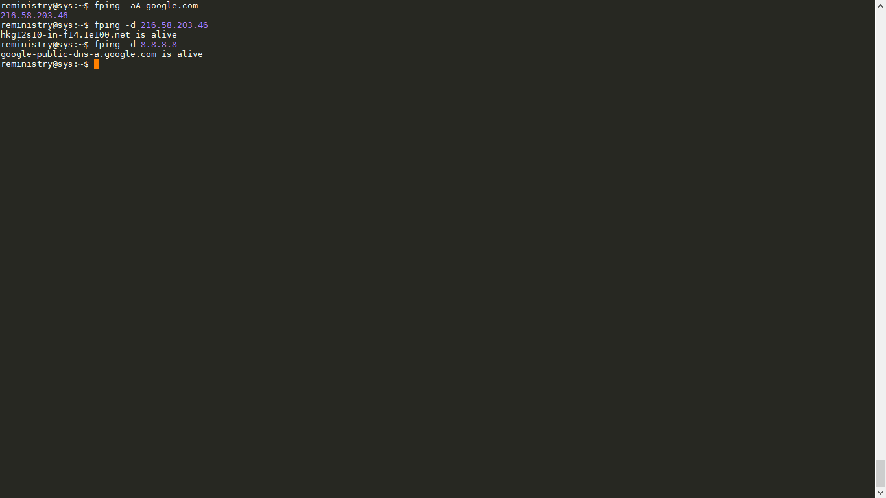

	- `fping -ed 8.8.8.8 -c 10`
		> 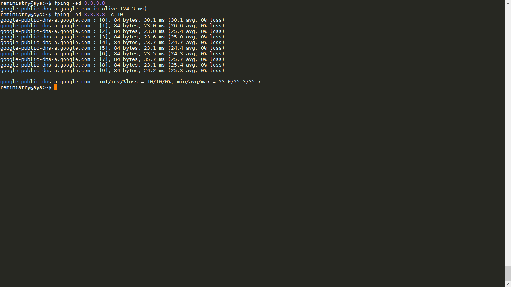

	- `fping -C 2 google.com google.com.vn`
		> 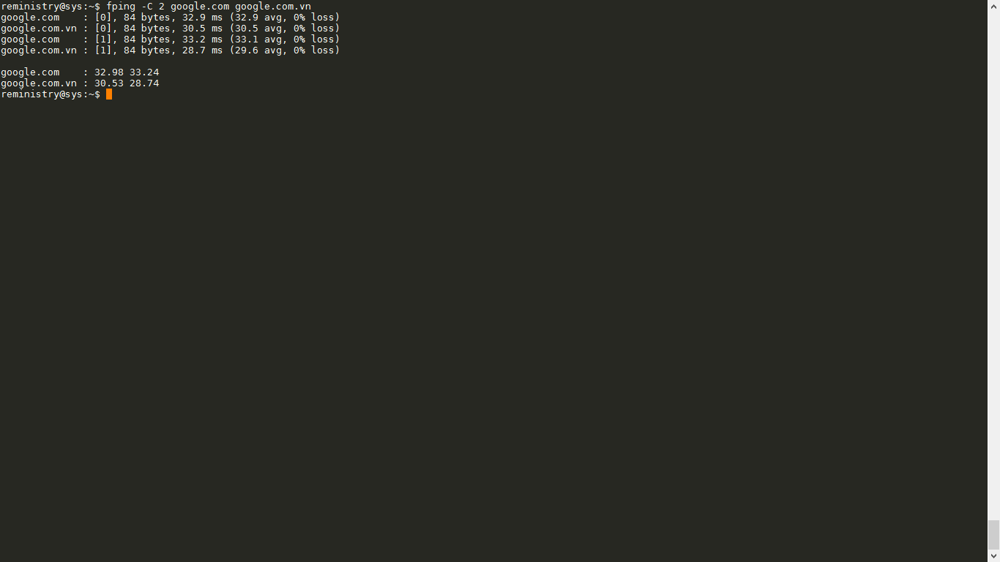

	- `fping -s google.com.vn `
		> 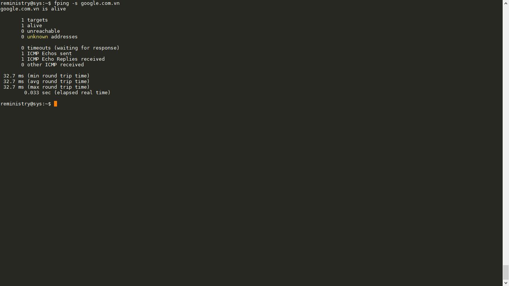

Phía trên là nhưng câu lệnh cơ bản rất là hữu ích cho việc chuẩn đoán mạng của fping cung cấp! Chúc các bạn học tập vui vẻ!