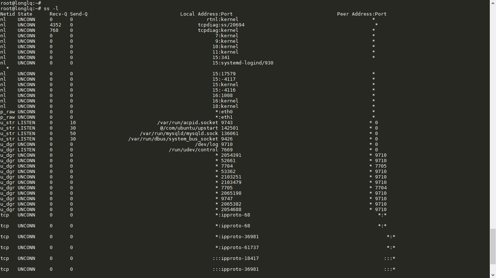
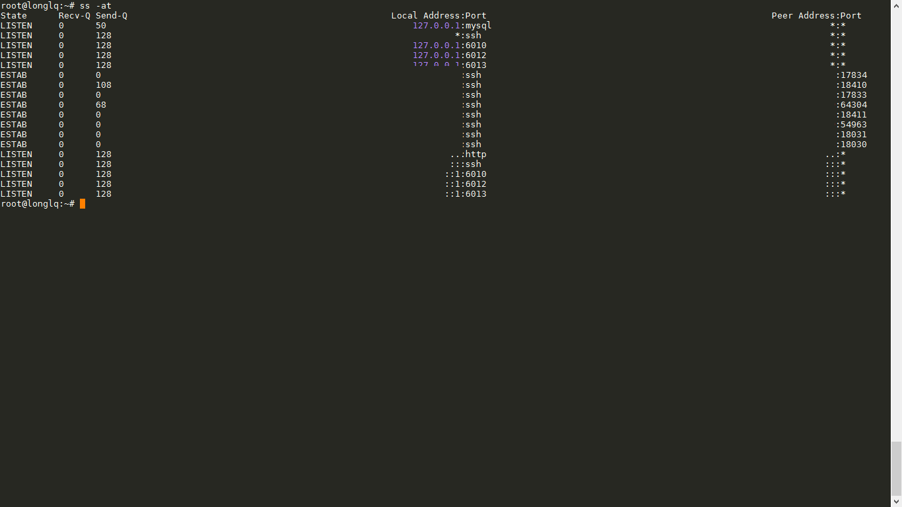
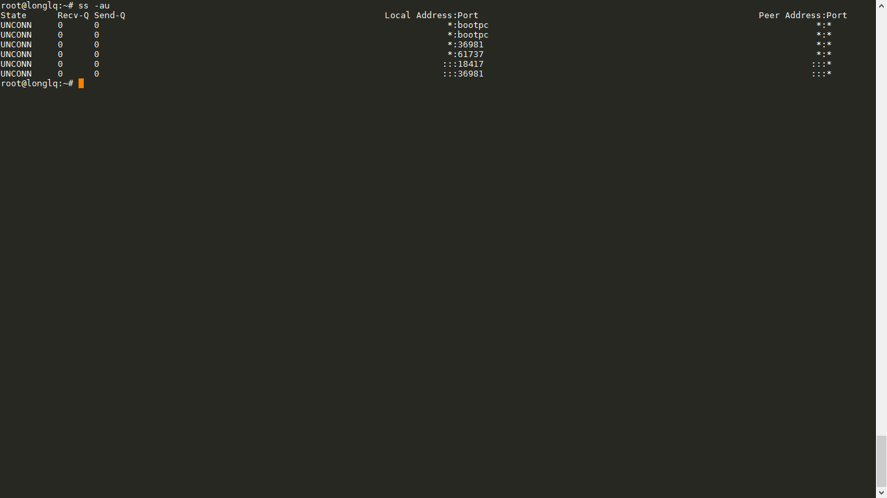
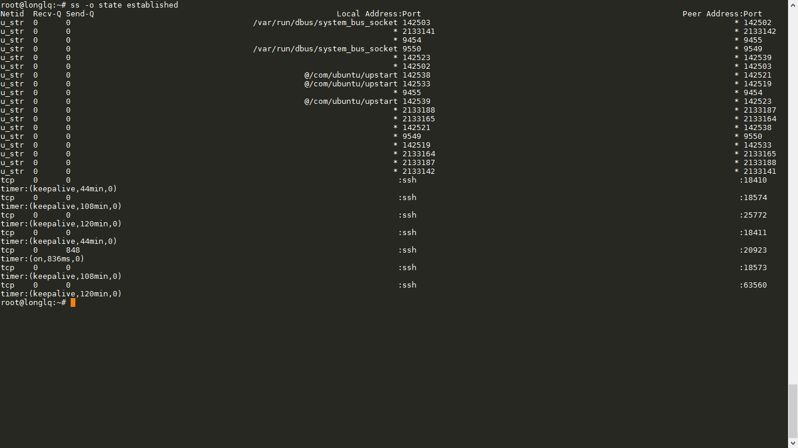

# Báo cáo: Tìm hiểu câu lệnh ss

# Mục lục

- [ss command là gì](#about)
- [Cách sử dụng ss command](#options)
- [Các ví dụ](#example)

## 1. SS Command là gì?

- `ss` là cụm từ viết tắt của `socket statistics` là câu lệnh có khả năng hiển thị nhiều thông tin hơn so với câu lẹnh `netstat` và nó nhanh hơn so với `netstat`. Bởi câu lệnh `netstat` chỉ đọc các file tiến trình để tổng hợp các thông tin, nó sẽ mắc phải những điểm yếu khi mà cố hiển thị thông tin về các kết nối thất bại. Chính điều này làm cho `netstat` trở lên chậm

- Câu lệnh `ss` nhận các thông tin về socket statistics một cách trực tiếp từ nhân hệ điều hành. Các tùy chọn đi kèm với ss command thì đơn giản hơn so với netstat khiến ss command có thể thay thế cho netstat một cách dễ dàng

- Câu lệnh ss là một câu lệnh khá mới và vô cùng hữu ích, hiệu quả ( so sánh với netstat command ) cho việc theo dõi các kết nối TCP và sockets. ss command cung cấp các thông tin về:
	+ Tất cả TCP sockets
	+ Tất cả UDP sockets
	+ Tất cả các kết nối ssh/ ftp/ http/ https đã thiết lập
	+ Tất cả các tiến trình local kết nối tới một server X
	+ Cho phép lọc các trạng thái kết nối như connected, synchronized, .. theo các địa chỉ, ports

## 2. Cách sử dụng ss command

- 2.1 Chi tiết về các options trong ss command
	+ Cấu trúc câu lệnh ss là: 
	    > `ss [options] [filter]`

	+ Các options bao gồm:
		- `-n, --numeric`: Không cần thiết phải phân giải tên dịch vụ
		- `-r, --resolve`: Phân giải tên dịch vụ thành địa chỉ/ ports
		- `-a, --all`: Hiển thị cả trạng thái `listening` và `non-listening` sockets
		- `-l, --listening`: Chỉ hiển thị các sockets có trạng thái listening (default)
		- `-e, --extended`: Hiển thị chi tiết về socket
		- `-m, --memory`: Hiển thị bộ nhớ mà sockets sử dụng
		- `-p, --processes`: Hiển thị tiến trình đang sử dụng socket
		- `-i, --info`: Hiển thị thông tin TCP nội bộ
		- `-s, --summary`: In số liệu thống kê một cách tổng quan.
		- `-4, --ipv4`: Chỉ hiện thị các socket IPv4
		- `-6, --ipv6`: Chỉ hiển thị các socket IPv6
		- `-0, --packet`: Hiển hị các packet sockets
		- ` -o, --options`: Hiển thị thời gian tồn tại, kết nối.
    	- `t, --tcp`: Hiển thị TCP sockets.

    	- `u, --udp`: Hiển thị UDP sockets.

    	- `d, --dccp`: Hiển thị DCCP sockets.

    	- `w, --raw`: Hiển thị RAW sockets.

    	- `x, --unix`: Hiển thị Unix domain sockets
		- `-F, --filter=FILE`   read filter information from FILE
		- `FILTER := [ state TCP-STATE ] [ EXPRESSION ]`

- 2.2 Các ví dụ về ss command

+ Liệt kê ra danh sách cả kết nối TCP sockets đang ở trạng thái ESTABLISHED, CLOSED, ..
	> `ss -s`
	

+ Hiển thị tất cả các cổng mạng đang mở
	> `ss -l`
	

+ Hiển thị tất cả TCP Sockets
	> `ss -at`
	

+ Hiển thị tất cả UDP Sockets
	> `ss -au`
	

+ Hiển thị các kết nối ESTABLISHED
	> `ss state established`
	

+ Làm thế nào để lọc các TCP sockets sử dụng các trạng thái???
	> `ss state tcp-state [expression]`
	
	Các giá trị tcp-state có thể là: established, closed, listen, connected, synchronized, ...

Trong những hình ảnh trên, mình xin phép được ẩn đi địa chỉ ip vì một số lí do khách quan.
