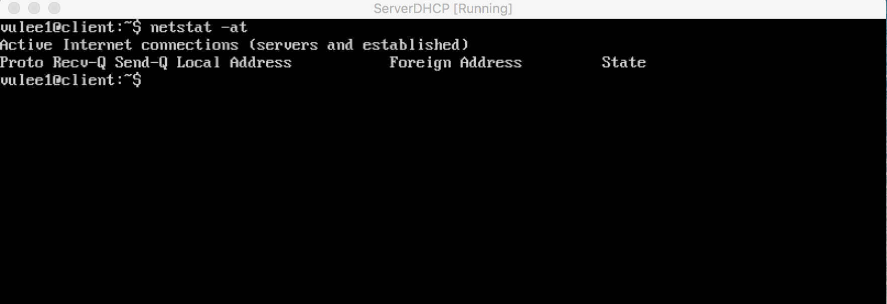
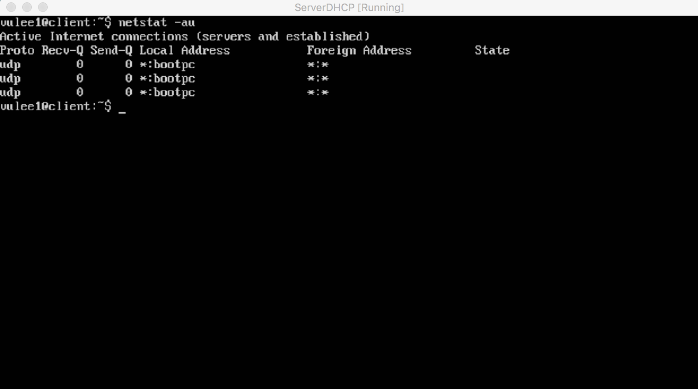
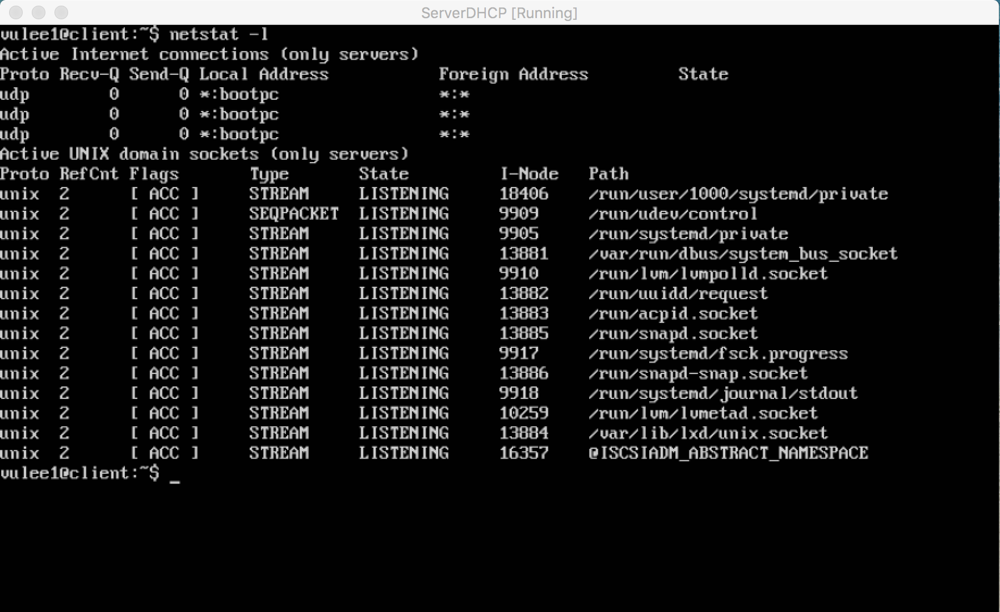
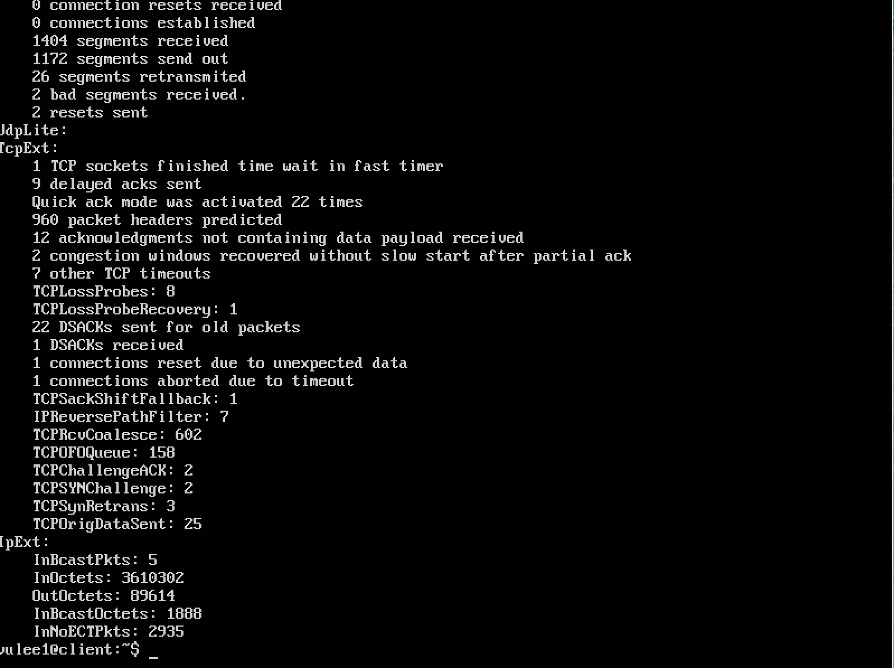
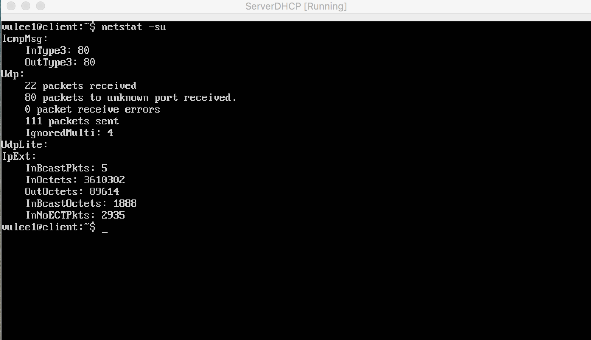
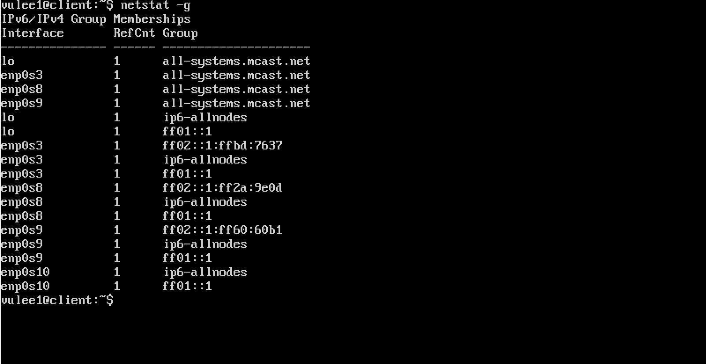
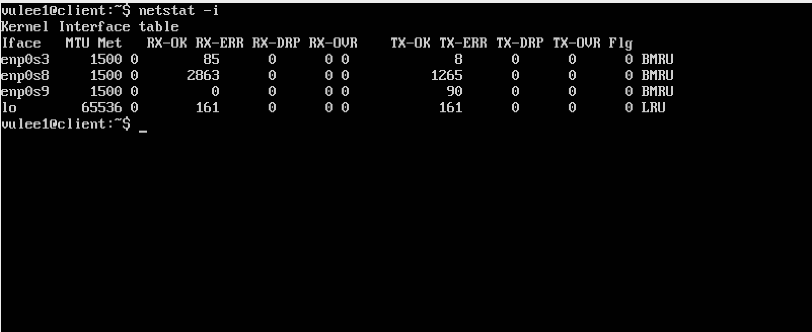

#Báo cáo hướng dẫn sử dụng Netstat (Network Statistics)

##Mục lục
-1. [Giới thiệu](#1)
-2. [Một số tuỳ chọn hay dùng](#2)

##1. Giới thiệu
<a name='1'></a>
-Netstat là 1 công cụ dòng lệnh để giám sát các kết nối vào ra như bảng định tuyến giao diện
-Nó rất hữu ích trong việc khác phục sự cố mạng và đo lường hiệu năng của mạng
-Netstat là 1 trong những công cụ gỡ lỗi dịch vụ cho phép bạn biết port nào mở và bất kì chương
trình nào đang lắng nghe trên cổng
-Netstat là công cụ quan trọng hữu ích cho các quản trị mạng Linux  cũng như các quản trị viên hệ
thống để theo dõi và khắc phụ sự cố liên quan đến mạng của họ và xác định hiệu suất lưu lượng mạng của họ

##2. Một số tuỳ chọn hay dùng
-Liệt kê các port về tcp
   ```
   netstat -at
   ```
   

-Liệt kê các port về udp
   ```
   netstat -au
   ```
   


-Liệt kê tất cả port đanglắng nghe
   ```
   netstat -l
   ```
   


-Liệt kê tất cả các port lắng nghe udp
   ```
   netstat -lu
   ```


-Liệt kê tất cả các port lắng nghe tcp
   ```
   netstat -lt
   ```

-Liệt kê tất cả các port lắng nghe unix
   ```
   netstat -lx
   ```

-Hiển thị số liệu thống kê bởi giao thức tcp, upd
   ```
   netstat -st hoặc netstat -su
   ```
   
   

-Hiển thị thông tin IPv4, IPv6
   ```
   netstat -g
   ```
   
-Hiện thị các giao diện mạng (interfaces)
   ```
   netstat -i
   ```
   
##Tham khảo: http://www.tecmint.com/20-netstat-commands-for-linux-network-management/
