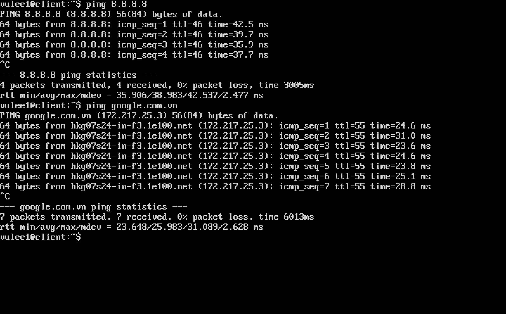
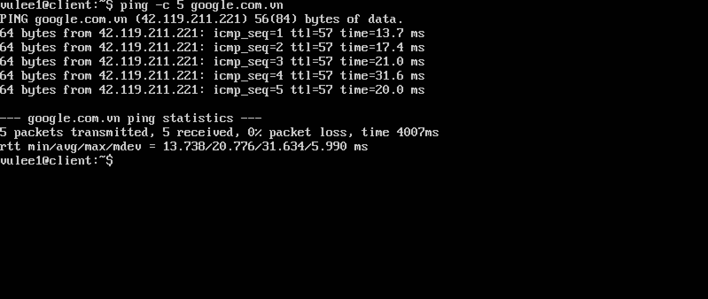
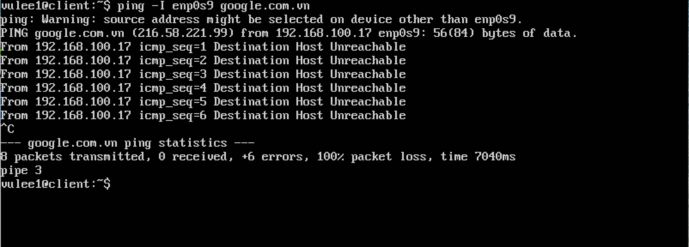
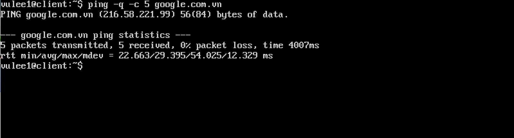
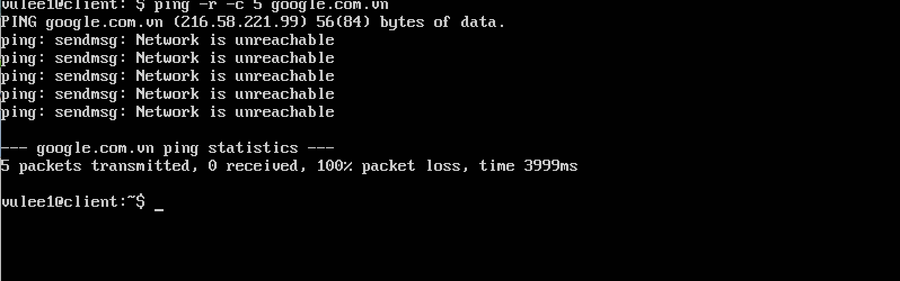

#Báo cáo về lệnh Ping

##Mục lục
-[1.Giới thiệu](#1)
-[2.Một số tuỳ chọn của lệnh ping](#2)
-[3.Các thông báo của lệnh ping](#3)

<a name='1'></a>
##Giới thiệu
-Lệnh Ping được sử dụng để kiểm tra nếu có một kết nối mạng với một máy tính khác.
-Khi một trình duyệt Web không thể kết nối với 1 trang web trên internet hoặc mạng cục
bộ (LAN) nguyên nhân thường là máy chủ web có thể lỗi hoặc quá tải hoặc có thể là sự cố mạng ngăn
cản kết nối với mạng. Do đó, bước đầu tiên bạn sẽ kiểm tra kết mối mạng có hoạt động không. Đó là
lúc bạn sử dụng lệnh ping.
-Bạn chỉ cần nhập sau ping URL hoặc địa chỉ IP, máy tính sẽ phản hồi 1 bản tóm tắt kết quả của mỗi lần
cố gắng liên lạc với máy tính đó.
-Ví dụ:
   ```
   ping 8.8.8.8
   ping google.com.vn
   ```
-Ping sử dụng ECHO_REQUEST để bắt buộc giao thức ICMP để tạo ra 1 ICMP ECHO_RESPONE từ máy chủ hoặc gate.

<a name='2'></a>
##2.Một số tuỳ chọn của lệnh ping
-Ping khi không sử dụng tuỳ chọn:
   ```
   ping 8.8.8.8
   ping google.com.vn
   ```
   
   Để kết thúc quá trình ping command, bạn sẽ sử dụng tố hợp phím Ctrl+C
-Tuỳ chọn: -c COUNT. Tuỳ chọn này, ping sẽ dừng lại sau khi gửi n gói tin đến máy tính khác.Với tuỳ chọn thời gian
ping sẽ đợi gói tin ECHO_REPLY đếm cho đến khi hết thời gian chờ
   ```
   ping -c 5 google.com.vn
   ```
   


-Tuỳ chọn: -i: Ở tuỳ chọn này, khoảng thời gian chờ giữa 2 gói tin thông thường là 1s. Bạn có thể thay đổi khoảng thời gian đó
   ```
   ping -i 5 google.com.vn
   ```
   Khi đó cứ 5s, bạn sẽ nhận được 1 gói tin trở về


-Tuỳ chọn: -l n. Ở tuỳ chọn này, bạn sẽ nhận được n gói tin trước
   ```
   ping -l 3 google.com.vn
   ```

-Tuỳ chọn: -I: Ở tuỳ chọn này, sẽ sử dụng network card đã được chỉ định trong lệnh ping
   ```
   ping -I enp0s8 google.com.vn
   ```
   

-Tuỳ chọn: -q: Ở tuỳ chọn này, chỉ hiển thị các dòng hiển thị khi khởi động và khi kết thúc (kết hợp vs tuỳ chọn -c)
   ```
   ping -q -c 5 google.com.vn
   ```
   

-Tuỳ chọn: -R: ghi lại lộ trình. Hiển thị bộ đệm tuyến đường trên các gói tin trở về.
   ```
   ping -R -c 5 google.com.vn
   ```

-Tuỳ chọn: -r: bỏ qua bảng định tuyến và gửi trực tiếp đến máy chủ. Nếu máy chủ không nằm trên mạng trực tiếp, lỗi sẽ được trả lại
   ```
   ping -r google.com.vn
   ```
   

-Tuỳ chọn: -s; Chỉ định số lượng byte dữ liệu được gửi đi. Mặc định là 56, dược chuyển thành 64 byte dữ liệu ICMP, khi kết hợp 8 byte ICMP header
   ```
   ping -s 100 google.com.vn
   ```

-Tuỳ chọn: -t tll: Đặt thời gian IP ttl
   ```
   ping -t 2 google.com.vn
   ```
   

-Tuỳ chọn: -w: Xác định khoảng thời gian thoát khỏi ping command
   ```
   ping -w 10 google.com.vn
   ```
   Sau 10s bạn sẽ thoát khỏi ping command

<a name ='3'></a>
##3.Các thông báo của lệnh Ping
Lệnh ping sẽ hiển thị thông báo và thống kê sau mỗi lần sử dụng lệnh. Nếu có lỗi xảy ra trên đường đi đến máy đích, lệnh ping sẽ hiển thị thông tin về lỗi. Dựa trên các thông tin này bạn sẽ xác định được một số nguyên nhân gây lỗi và cách khắc phục.
Có 3 thông báo thường được hiển thị khi sử dụng lệnh ping:
        -Reply from 192.168.101.100: bytes=32 time<1ms TTL=128
        -Request timed out
        -Destination host unreachable
3.1. Thông báo: Reply from 192.168.101.100: bytes=32 time<1ms TTL=128
Khi nhận được thông báo có dạng như trên thì có nghĩa là lệnh ping đã thực hiện thành công và hệ thống không có lỗi:
Địa chỉ IP sau từ “Reply from” cho biết máy nào đang gửi thông điệp trả lời.
bytes=32 là kích thước của gói tin ICMP được gửi đi.
time<1ms thời gian của quá trình hồi đáp chỉ tốn dưới 1 mili giây
TTL=128 là giá trị “time to live” (thời gian sống) của gói tin ICMP. Hết thời gian này thì gói tin sẽ bị hủy.
Giá trị TTL được ứng dụng tùy hệ điều hành và nó là “thước đo” giới hạn “thời gian sống” của datagram trong gói tin gửi đi. TTL khởi tạo bằng giá trị ấn định của hệ điều hành (trong trường hợp này là 128) và con số này giảm bớt 1 đơn vị mỗi khi nó đi qua một router. Khi giá trị TTL này trở thành 0 (zero) thì datagram này bị hủy cho dù nó chưa đến được nơi nó cần “ping”. Nếu bạn “ping” một host nào đó trong cùng một subnet (không qua router nào cả) thì giá trị TTL không hề thay đổi.
3.2. Thông báo: Request timed out
Nếu không kết nối được với máy đích thì Ping sẽ hiển thị thông báo là “Request timed out”.
Thông điệp “Request timed out” có nghĩa là không có hồi đáp trả về. Khi gặp thông báo này thì bạn có thể có chẩn đoán các nguyên nhân gây ra lỗi như sau:
-Thiết bị định tuyến Router bị tắt.
-Địa chỉ máy đích không có thật hoặc máy đích đang bị tắt, hoặc cấm ping.
-Nếu máy đích khác đường mạng với máy nguồn thì nguyên nhân có thể do không có định tuyến ngược trở lại máy nguồn. Lúc này, nếu máy đích đang chạy,
 bạn có thể kiểm tra đường đi về của gói tin bằng cách xem lại thông số Default Gateway trên máy đích, máy nguồn và router kết nối các đường mạng.
-Độ trễ của quá trình hồi đáp lớn hơn 1 giây. Phiên làm việc của lệnh ping mặc định là 1 giây. Nhưng nếu quá trình hồi đáp lớn hơn 1 giây mà gói tin vẫn chưa đến đích thì lệnh ping cũng thông báo lỗi trên. Bạn có thể sử dụng tùy chọn -w để tăng thêm thời gian hết hạn. Ví dụ cho phép kéo dài quá trình hồi đáp trong vòng 5 giây sử dụng bạn dùng lệnh ping -w 5000.
3.3. Thông báo: Destination host unreachable
Thông báo cho biết không thể kết nối đến máy đích. Nguyên nhân gây ra lỗi này có thể là do cáp mạng bị đứt, không gắn cáp vào card mạng, card mạng bị tắt,
Driver card mạng bị hư…
##Tham khảo: http://www.tutorialspoint.com/unix_commands/ping.htm
             http://www.computerhope.com/unix/uping.htm
